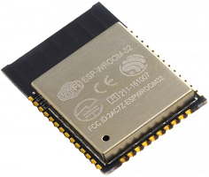
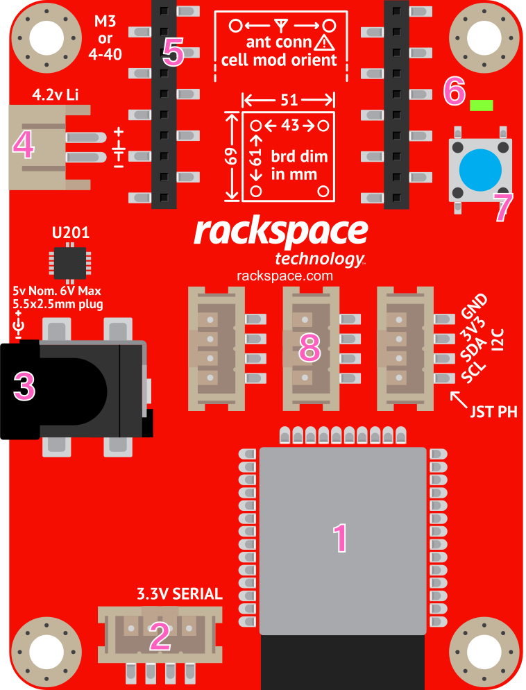
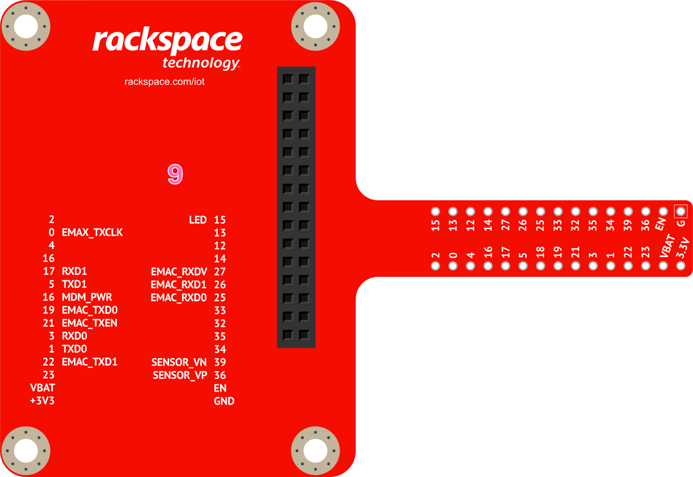

03 - Rackspace IoT Feature Tour
================================

ESP32 Features
~~~~~~~~~~~~~~~~~~~~~~~~~~~~~~~~
Your Rackspace IoT Development board is built around the powerful Esspresif ESP32 Microcontroller Unit (MCU).  The ESP32 chip is small and affordable, with features that are perfectly suited for a broad range of IoT applications. The ESP32 is equipped with GPIO pins, and includes support for a variety of protocols like SPI, I2C, UART, and more. One key feature of the ESP32 is that both wireless networking and Bluetooth are included onboard the MCU itself.  This sets the ESP apart from other microcontrollers like those found on boards like Arduino and Rasberry Pi, for which WiFi and Bluetooth require additional onboard components, or add on hardware. This means that you can easily control and monitor an ESP32 based devices remotely without the need for additional WiFi or Bluetooth components.

**Features of the ESP32 MCU:**

- Xtensa Dual-Core 32-bit LX6 with 600 DMIPS @160 MHz
- 802.11 b/g/n Wi-Fi
- Bluetooth 4.2 and BLE
- SRAM and Flash capable
- 36 GPIO pins
- 16 software PWM channels
- Common protocol interfaces: 4 SPI, 2 I2C, 2 I2S, 2 UART
- 12-Bit Analog to Digital Converter (ADC)
- Controller Area Network (CAN) enabled
- Ethernet MAC interface
- Onboard sensors
   - Capacitive touch
   - Temperature
   - Hall effect
- Operating temperature range: -40ºC to 125ºC

----

Rackspace IoT Features
~~~~~~~~~~~~~~~~~~~~~~~~~~~~~~~~
The Rackspace IoT Development board expands on the capabilities of the ESP32 chip, by providing additional hardware common to many enterprise IoT development projects.  Below is a diagram of the Rackspace IoT board and its components:

1. ESP32 MCU
2. 3.3V Serial JST connector
3. Barrel jack power connector
4. External battery connector, and onboard charger
5. LTE Cell modem ready
6. Status LED
7. Button
8. 3 JST connectors, wired for I2C
9. 30-pin breakout board/breadboard adapter, with pinout diagram
10. Micro-USB port, which provides USB to serial and can power the board (not shown)

----

Convenience Functions
~~~~~~~~~~~~~~~~~~~~~~~~~~~~~~~~
Your Rackspace IoT board includes a number of convenience functions, which are baked into the ``rackspaceiot`` module of the Micropython firmware.  These functions allow you to easily interact with the sensors of the ESP32, as well as some hardware features of the board.  In this section, we will walk through the convenience functions that are available.

This section assumes you have:

- A working Rackspace IoT Developer Kit
- Succesfully completed the setup process for your device in section :doc:`../setup/setup`, and you are currently connected to your device via your WiFi and WebREPL session.

Below are descriptions of the the available convenience functions:

- ``rackspaceiot.led('on')`` - turns the STATUS LED on
- ``rackspaceiot.led('off')`` - turns the STATUS LED off
- ``rackspaceiot.blink(delay_ms, duration_sec)`` - blinks the STATUS LED with a delay in ms and duration in seconds
- ``rackspaceiot.hall()`` - reads the value of the onboard hall effect sensor, which can be used to measure magnetic fields near the ESP32 chip.
- ``rackspaceiot.temp()`` - reads the value of the onboard temperature sensor.
- ``rackspaceiot.touch()`` - reads the value of an onboard capacitive touch sensor, mapped to PIN12 on the Rackspace IoT board.
- ``rackspaceiot.read_all()`` - reads all onboard sensor values above, and returns them in JSON format.

Using the WebREPL console terminal, you can experiment with the different functions above.    Here are some examples::

    >>> rackspaceiot.led('on')
    # STATUS LED turns on

    >>> rackspaceiot.led('off')
    # STATUS LED turns off

    >>> rackspaceiot.blink(500, 10)
    # STATUS LED blinks every 500 milliseconds, for 10 seconds

    >>> rackspaceiot.hall()
    73

    >>> rackspaceiot.temp()
    131

    >>> rackspaceiot.touch()
    375

    >>> rackspaceiot.read_all()
    {"touch": 375, "hall": 69, "temp": 131}

Now, try to vary the sensor readings, and run each function again to see the values change.  Examples:

- Place the Rackspace IoT board in a warm place, in direct sunlight, or touch the metal MCU case with your hand to change the ``temp()`` reading (it will change *very* little due to the low resolution of the onboard temp sensor)
- Place a magnet near the MCU chip, and see the ``hall()`` reading change.
- Insert a jumper wire into the breadboard, next to pin12 on the Rackspace IoT breakout board.  Touch the free end of the jumper with you finger, and see the ``touch()`` reading change.

Next, try to read all the sensor values continuously.  Using the methods described above, you can vary the sensor readings in realtime, and watch them change in the WebREPL output::

    >>> from time import sleep
    >>> while True:
    ...     rackspaceiot.read_all()
    ...     sleep(1)
    # press Enter 4 times
    {"touch": 382, "hall": 70, "temp": 132}
    {"touch": 382, "hall": 70, "temp": 132}
    {"touch": 382, "hall": 68, "temp": 132}
    {"touch": 382, "hall": 71, "temp": 132}
    ...
    ...
    ...

    # CTRL + C to break
    Traceback (most recent call last):
    File "<stdin>", line 2, in <module>
    KeyboardInterrupt: 
    >>> 

Note that on-chip sensor readings are not calibrated to any particular scale, nor are they expected to be terribly consistent from device to device.  For example, the temperature reading is just a raw sensor value, it does not map directly to an actual temperature value.  For more reliable readings, we will use more accurate sensors in a later section.

The following functions are also supported, but are not used in this walkthrough, and should only be used by users who are comfortable with their operation:

- ``rackspaceiot.setup()`` - connects to WiFi networks configured in ``rackspace_iot_cfg.json``.  If no config is present, or all WiFi connections fail, will automatically enable the Access Point for troubleshooting.
- ``rackspaceiot.connect_sta_if()`` - connects to WiFi networks configured in ``rackspace_iot_cfg.json``, but does not enable the AP on failure or missing config.
- ``rackspaceiot.enable_ap_if()`` - enables the Access Point interface, regardless of the state of the WiFi interface.  Access point info: Network Name: ``RackspaceIoT-######`` (where ###### is the MAC address of the device), IP address: ``192.168.4.1``, Password: ``rackspace``

Safe Mode Boot
~~~~~~~~~~~~~~~~~~~~~~~~~~~~~~~~
While unlikely, there are some failure modes that could make it difficult for a user to connect to their board to troubleshoot.  Some of these scenarios include, but are not limited to:

- Running code that spawn resource intensive `tight loops`, that cause the WebREPL to be slow or unresponsive.

- Automatic execution of ``main.py``, without a successful connection to WiFi or enabling the WebREPL.  This is a default behavior of Micropython, that will be covered in a later section.

- Automatic execution of code from ``boot.py``, without a successful connection to WiFi or enabling the WebREPL.   

- Successful connection to a WiFi network, to which the user can no longer access.

To mitigate these and other possible scenarios, your Rackspace IoT board supports a **safe mode boot** option.  Booting into safe mode will:

- skip the automatic execution of any code (including ``main.py``, and code called from ``boot.py``)
- skip attempting to connect to WiFi
- enable the Access Point and WebRREPL only

In this state, a user can easily connect to the Access Point WiFi network, and troubleshoot the device using the WebREPL, without interference caused by background code. To enter safe mode boot, follow the steps below:

1. Power off the device by unplugging the micro usb cable.
2. Press **and hold** the blue button on the device.
3. While continuing to hold the button, power on the device by plugging the micro usb cable back into the device.
4. Carefully watch the STATUS LED, located above the button.
5. When the LED blinks rapidly for 5 seconds, your device has entered **safe boot mode**
6. Release the button
7. Connect to the device AP and WebREPL using the same steps described in section :doc:`../setup/setup`.

Factory Reset
~~~~~~~~~~~~~~~~~~~~~~~~~~~~~~~~
In the event that a board becomes unresponsive, the firmware may be flashed back to the original factory settings:

- Install ``esptool.py`` following the instructions found `here <https://github.com/espressif/esptool>`_ 

- Download the ``v0.1-preview.bin`` firmware file found `here <https://github.com/onicagroup/rackspace-iot/releases/download/v0.1-preview/v0.1-preview.bin>`_

- Establish a serial connection with your Rackspace IoT board.  Instructions for doing so can be found `here <https://docs.espressif.com/projects/esp-idf/en/latest/get-started/establish-serial-connection.html#>`_.  Note that the Rackspace IoT board uses an FT232RL usb to serial chip, so the intructions may need to be modified slightly depending on your operating system.

- In a console terminal execute the command below to erase the board::

    esptool.py --chip esp32 -p /path/to/usbserial erase_flash

- When the board is erased, navigate to the directory location where you downloaded the ``v0.1-preview.bin`` firmware above, and flash the firmware::

    esptool.py --chip esp32 -p /path/to/usbserial write_flash -z 0x1000 v0.1-preview.bin
    
- You should see output similar to that below, indicating your board has been sucessfully flashed::

    Uploading stub...
    Running stub...
    Stub running...
    Configuring flash size...
    Auto-detected Flash size: 4MB
    Compressed 1079600 bytes to 682898...
    Wrote 1079600 bytes (682898 compressed) at 0x00001000 in 60.6 seconds (effective 142.4 kbit/s)...
    Hash of data verified.

    Leaving...
    Hard resetting via RTS pin...

- You can now return to the :doc:`../setup/setup` section to re-connect to your board.
