02 - IoT `Hello World` on AWS
==============

The intent of this section is to go from zero to a working IoT project in just a few minutes and a few simple lines of code.  Emphasis is on simplicity and getting your Rackspace IoT DevKit sending IoT data as quickly as possible, without
slowing down to examine what is happening under the hood.  In later sections, we will dive deeper into the underlying functionality demonstrated here.

This walkthough assumes you have:

- A working Rackspace IoT Developer Kit
- Succesfully completed the setup process for your device in section :doc:`../setup/setup`, and you are currently connected to your device via your WiFi and WebREPL session.
- Downloaded or cloned the Rackspace IoT repository
- Privileged access to a **non-production** Amazon Web Services (AWS) account, which you can sign up for `here <√>`_.

----

Configure AWS IoT, and Download Certificates
~~~~~~~~~~~~~~~~~~~~~~~~~~~~~~~~
- Log in to your AWS account Management Console
- On the Management Console Dashboard, use the search tool to locate ``IoT Core``, and click on it.
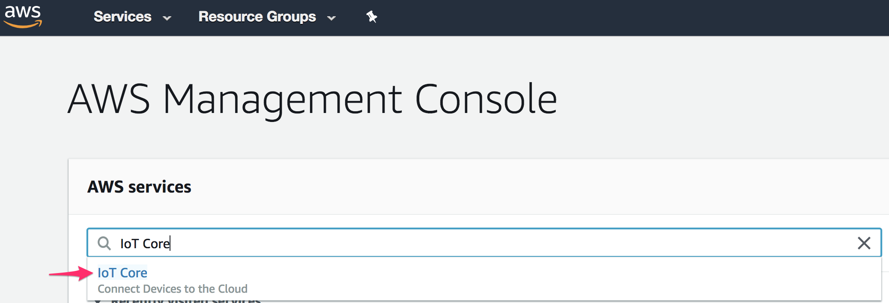

- If you are shown the AWS IoT splash screen, click **Get started** to proceed to the Console
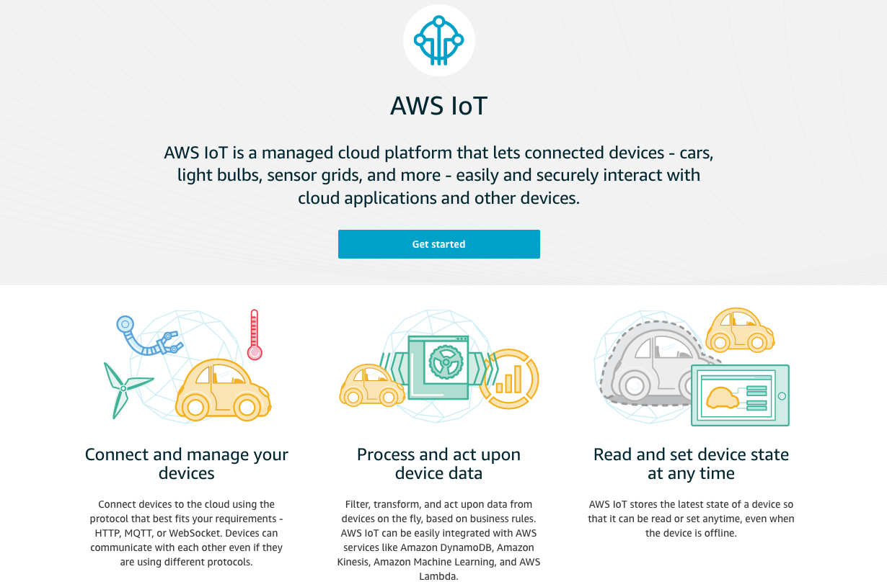

- Once in the AWS IoT Console, navigate to **Secure >> Certificates** and click **Create**
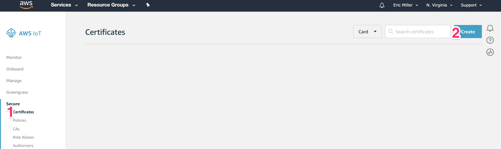

- Next to 'One-click certificate creation (recommended)', click **Create certificate**
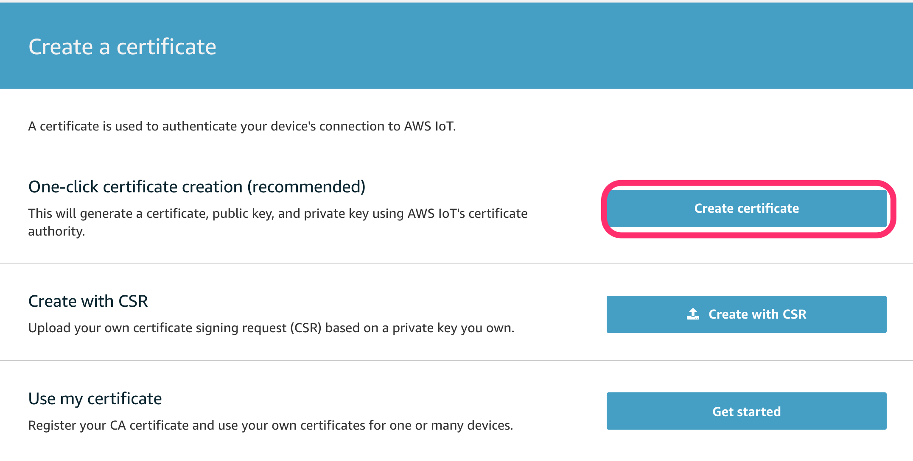

- On the next screen:
    1. Next to 'A certificate for this thing', click **Download**
    2. Next to 'A private key', click **Download**
    3. Click the **Activate** button.  You should see a popup message indicating successful activation, and the button will switch to read **Deactivate**
    4. Click **Attach a policy**

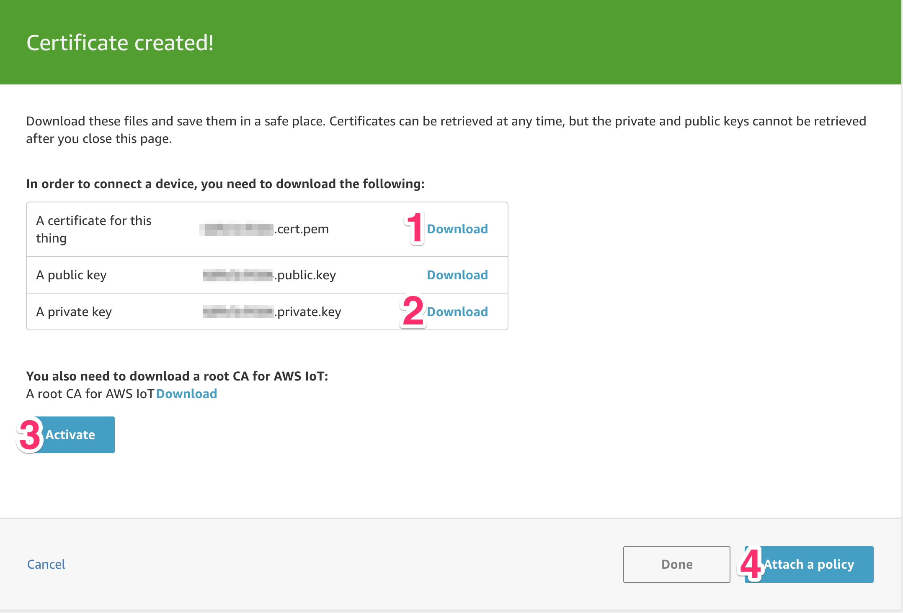

- On the next screen, click **Create new policy**

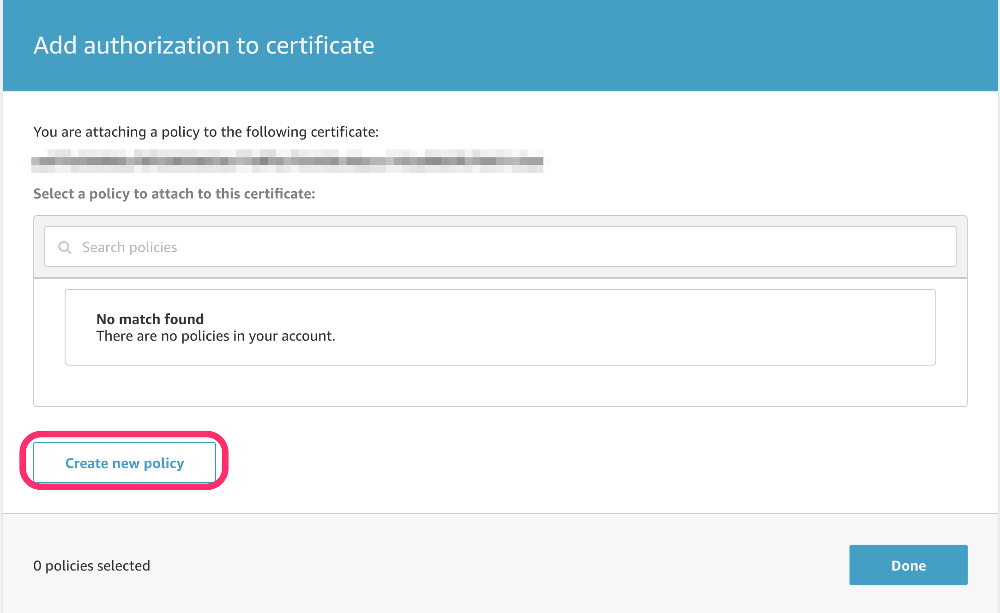

- On the next screen:
    1. Name the policy ``rackspaceiot``
    2. Click **Advanced Mode**

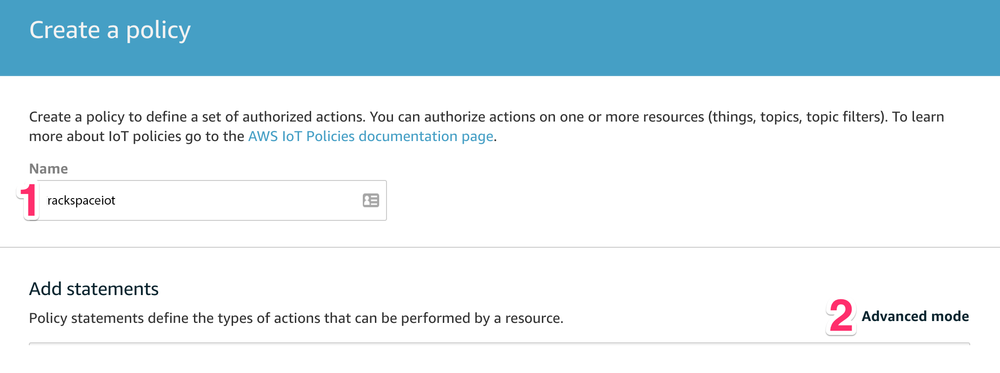

- In the Advanced Policy creation screen:
    1. Delete the default text, and replace it with the IAM Policy text below::

        {
            "Version": "2012-10-17",
            "Statement": [{
                "Effect": "Allow",
                "Action": [
                    "iot:Publish",
                    "iot:Connect"
                ],
                "Resource": "*"
            }]
        }

    2. Click **Create**

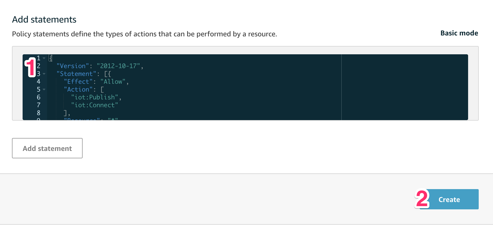

- Attach the policy you just created to your certificate.  To do this:
    1. In the AWS IoT Console, navigate to **Secure >> Certificates**
    2. Click the ellipsis ``...`` on the certificate you created above, and  choose **Attach Policy**
    3. Chose the ``rackspaceiot`` policy you created, and click **Attach**

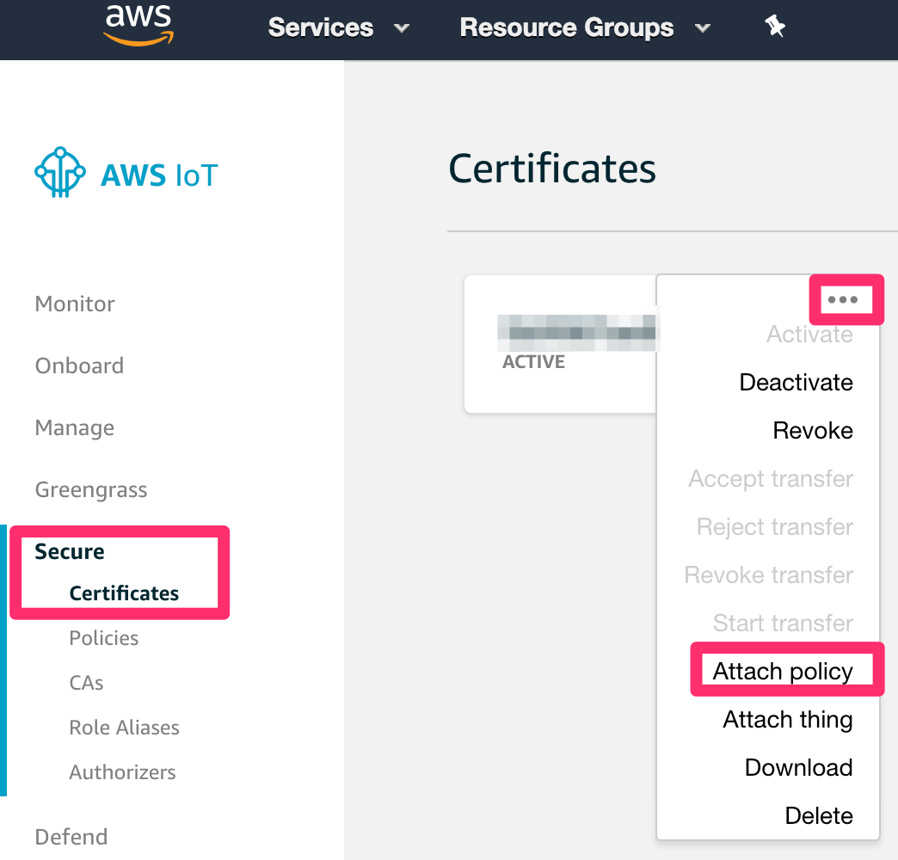

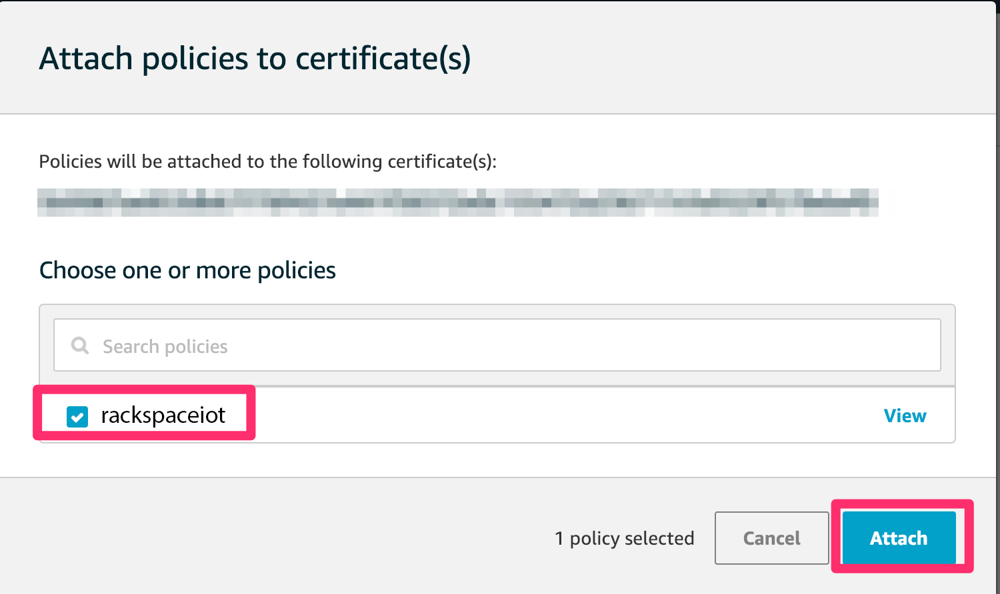

Add your IoT Endpoint to `hello_world.py`
~~~~~~~~~~~~~~~~~~~~~~~~~~~~~~~~
- Back in the AWS IoT Console, click **Settings**, and copy the **Endpoint** value into your clipboard.

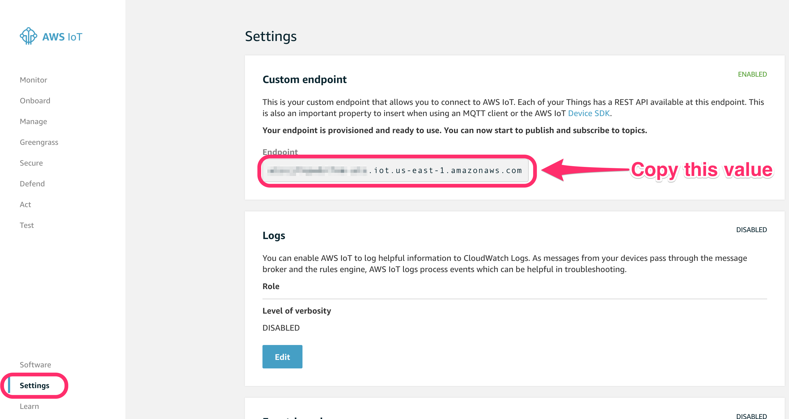

- In your Rackspace IoT repository, navigate to ``hello_world.py`` in the root directory of the repo, and open that file in a text editor.
- Edit the line below, pasting the **Endpoint** value copied above to replace the default value::

    # original line
    endpoint = 'REPLACE_WITH_YOUR_ENDPOINT'

    # becomes
    endpoint = '1234abcd5678ef-ats.iot.us-east-1.amazonaws.com'

- **Save** the file, and close the text editor.

Upload files to your Rackspace IoT device
~~~~~~~~~~~~~~~~~~~~~~~~~~~~~~~~~~~~~~~~~
- Back in the WebREPL session in your browser, ensure your session is still active. Place your cursor in the REPL console, and press the **Enter** key several times.  If your session is active, each press should return a Python REPL prompt ``>>>``.  If not, click **Disconnect**, refresh the page, and reconnect as before.  Do not proceed until your WebREPL sesssion is active.

- Using the same **Choose File>>Send to device** method that you used during Setup to upload your WiFi connection info, transfer the following three files one at a time to the device:

    1. The certificate you downloaded from AWS IoT in Step 1, ending in ``-certificate.pem.crt``
    2. The private key you downloaded from AWS IoT in Step 1, ending in ``-private.pem.key``
    3. The ``hello_world.py`` file, that you edited in step 2 to include your IoT endpoint.
    
- Ensure each file uploaded sucessfully, by listing the files in the WebREPL::

    >>> import os
    >>> os.listdir()
    ['boot.py', 'rackspace_iot_cfg.json', 'ab12345678-certificate.pem.crt', 'ab12345678-private.pem.key', 'hello_world.py']
    >>> 

- If any uploaded file is missing from the list of files on the device, upload and list again until all three files are listed on the device.

Send 'Hello World!' to AWS IoT
~~~~~~~~~~~~~~~~~~~~~~~~~~~~~~~~
- In the WebREPL terminal, run the ``hello_world.py`` script, and notice the message publishing logs.  Note: to execute a script manually in Micropython, you ``import`` the script as a module, leaving off the ``.py`` extension as shown below.

    >>> import hello_world
    published to topic rackspaceiot: {'message': 'Hello World!'}
    published to topic rackspaceiot: {'message': 'Hello World!'}
    ...
    ...

- Return to the AWS IoT Dashboard in your browser, and:
   1. Click **Test**
   2. Enter ``rackspaceiot`` in the **Subscription topic** field
   3. Click **Subscribe to topic**

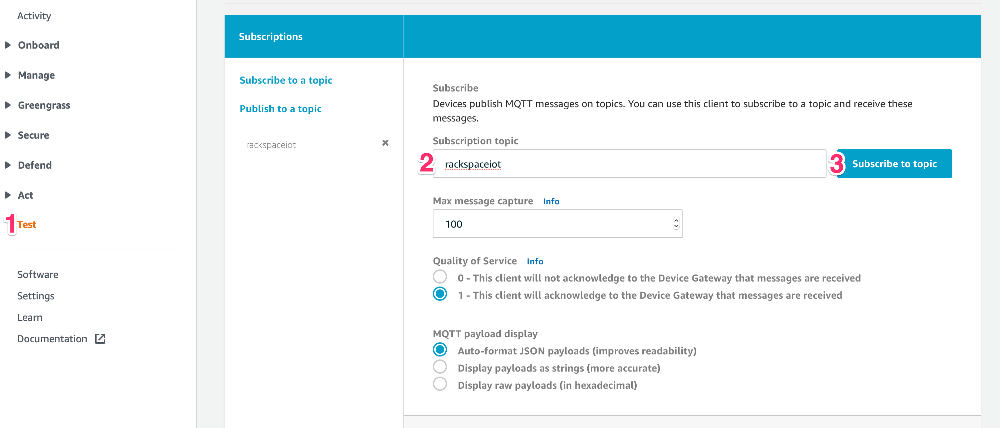

- Observe your `Hello World!` messages being ingested by AWS IoT:

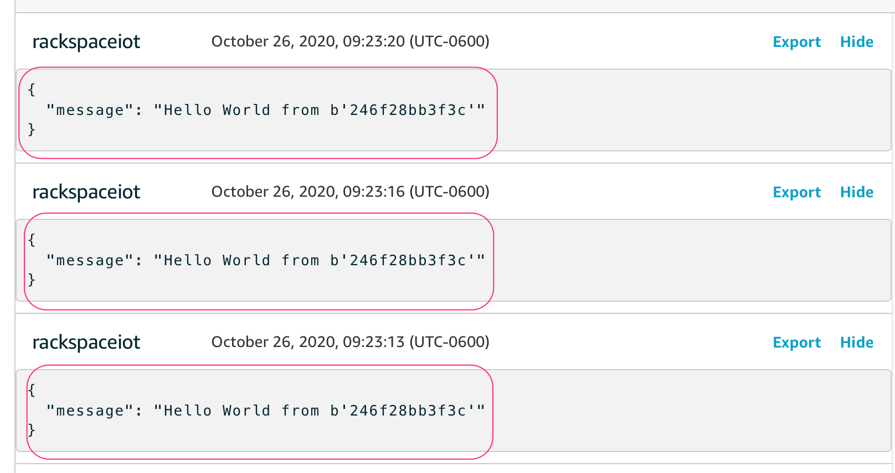

- To stop sending messages, type ``CTRL+C`` in your WebREPL console terminal, you will see the execution break below, which is normal::

    Traceback (most recent call last):
    File "<stdin>", line 2, in <module>
    KeyboardInterrupt: 
    >>> 