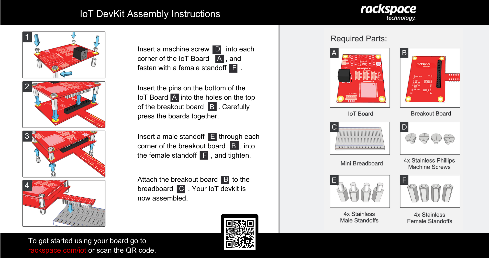
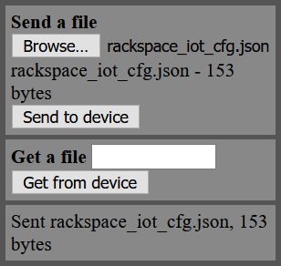

01 - Setup
==============

Unboxing and Assembly
--------------------- 
- Unbox and assemble your Rackspace IoT Developer Kit using the instructions provided below (click image to enlarge):

- Power your device with the micro-usb cable provided to the micro-usb port on the Rackspace IoT board.  You can use any standard USB port, or the USB wall adapter provided.
----

Download or Clone Repository
--------------------- 
- **Direct Download**
    - Download the Rackspace IoT Git repository `here <https://github.com/onicagroup/rackspace-iot/archive/preview.zip>`_.
    - Unzip the downloaded file on your local workstation
- **Git Clone**
    - Git users can clone the repository directly: ``git clone -b preview https://github.com/onicagroup/rackspace-iot.git``
----

Connect to Your Device
---------------------
Your Rackspace IoT development board comes pre-flashed with an optimized version of `Micropython <http://micropython.org/>`_, a lean and efficient implementation of the Python 3 programming language that includes a small subset of the Python standard library, and is optimised to run on microcontrollers and in constrained environments.  Python utilizes a interactive 'Read-Evaluate-Print-Loop' (REPL) as a programming interface, which takes single user inputs or expressions, evaluates them, and returns the results to the user.  The REPL provides an interactive ``>>>`` prompt when working with Python directly in a command line terminal.

Your Rackspace IoT device supports a version of the Python REPL called the WebREPL, which can be used to interact with the device in a web browser over WiFi.  The section below will cover configuring your device for your local WiFi network, and connecting to your device via the WebREPL:

1 - Enable the Rackspace IoT Access Point, and Connect
~~~~~~~~~~~~~~~~~~~~~~~~~~~~~~~~
- Find the small rectangular LED labelled `STATUS`, it is located just above the blue button on the Rackspace IoT device.  The STATUS LED is used to indicate when the device enters Access Point (AP) mode, which will allow your workstation to connect to the device via WiFi.
- Briefly unplug the power from the device, and plug it back in.  After a moment, the STATUS LED will blink rapidly for 5 seconds, indicating AP mode.
- Connect your workstation WiFi to the network named ``RackspaceIoT-######``, with password ``rackspace``

2 - Connect to the WebREPL
~~~~~~~~~~~~~~~~~~~~~~~~~~~~~~~~
- In the repository folder, browse to ``webrepl/webrepl.html``, and open the .html file in a browser.
- Accept the default values, and click the **Connect** button.
- When prompted, provide password ``rackspace`` (password will not show while typing, this is normal)
- After authenticating successfully, you will be presented with a MicroPython interactive WebREPL session::

    Welcome to MicroPython!
    Password:
    WebREPL connected
    >>>

3 - Upload WiFi Settings
~~~~~~~~~~~~~~~~~~~~~~~~~~~~~~~~
- Browse to the file named ``rackspace_iot_cfg.json`` in the root of the repository folder, and open it in a text editor.
- Replace the three default values with those for your local WiFi network, keep other values and formatting of the file unchanged, example::

    # original file
    {
        "wlans": [{
                "friendly_name": "friendly_name",
                "essid": "wifi_ssid",
                "passwd": "wifi_password"
            }
        ]
    }

    # becomes (example)
    {
        "wlans": [{
                "friendly_name": "my home wifi",
                "essid": "ATT288-5G",
                "passwd": "hunter2"
            }
        ]
    }

- **Save the file**, and close the text editor.
- Back in your WebREPL browser window, click **Choose File**, browse to the saved file above, and click **Send to device**
- Ensure your WebREPL indicates ``Sent rackspace_iot_cfg.json, 153 bytes`` or similar message, before continuing (your file's size in bytes may be different):

4 - Connect Device to WiFi
~~~~~~~~~~~~~~~~~~~~~~~~~~~~~~~~
- In the WebREPL console, run ``rackspaceiot.setup()`` and observe the output, similar to that below::

    >>> rackspaceiot.setup()
    config file ./rackspace_iot_cfg.json found
    wifi scanning
    found wlan ATT288-5G
    connecting to wlan my home wifi/ATT288-5G...
    connection to wlan my home wifi/ATT288-5G successful! To continue:
    1. reconnect your workstation to wifi network: ATT288-5G
    2. once reconnected, connect to webrepl on:
    ws://192.168.1.243:8266/                               
    >>>   

- Copy the WebREPL target value from your console output, similar to ``ws://192.168.1.243:8266/``, being careful to include the ``ws://`` and the trailing ``/``. Note that your output will be a similar format, but a different address.  **IMPORTANT: Losing this value will require entering Safe Mode, and repeating steps 2-4!**, so consider saving this value in a text file to avoid having to repeat the steps above.

5 - Connect to the WebREPL over WiFi
~~~~~~~~~~~~~~~~~~~~~~~~~~~~~~~~
- Click **Disconnect** in the WebREPL browser window.
- Disconnect your workstation from the ``RackspaceIoT-######`` wireless network.
- Reconnect your workstation to your local WiFi network.
- **Refresh** the WebREPL page in your browser.
- In the connection field at the top of the WebREPL page, paste the value you copied in step 4 above.
- Click the **Connect** button, and provide password ``rackspace`` when prompted.  You should now be connected to your device via WebREPL over your wifi::

    Welcome to MicroPython!
    Password: <masked>
    WebREPL connected
    >>>